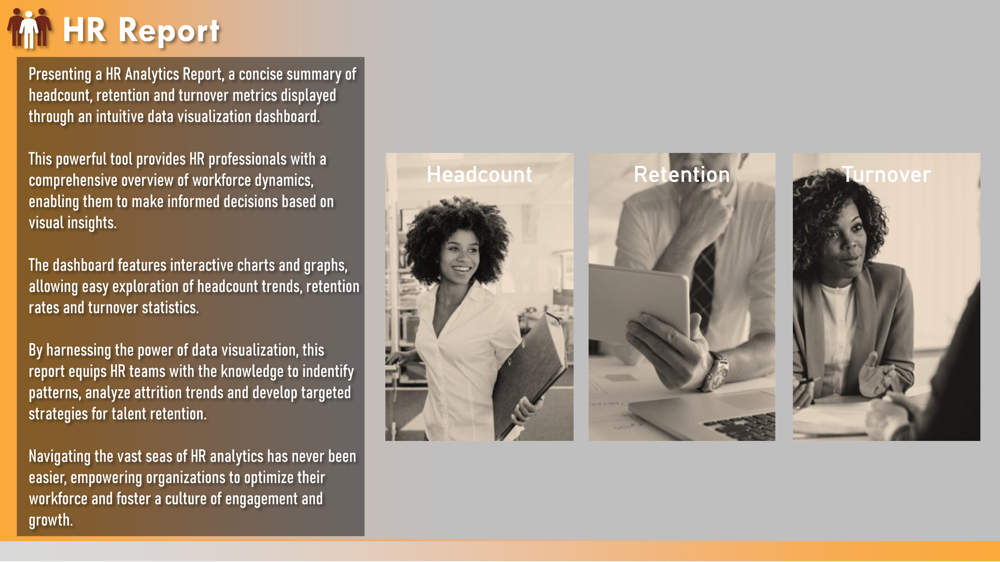
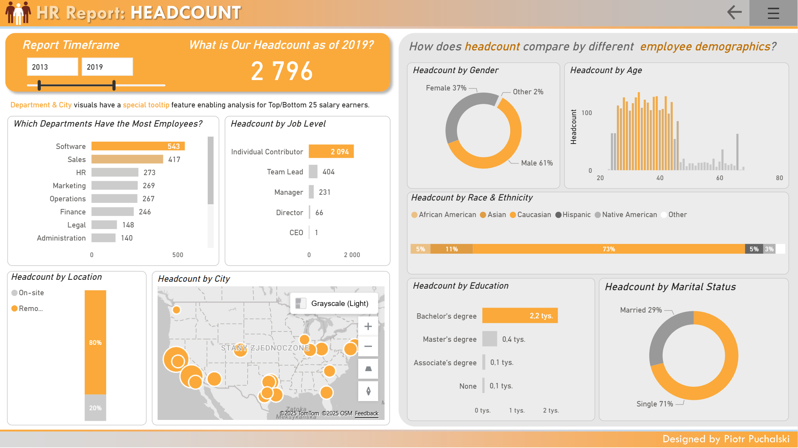
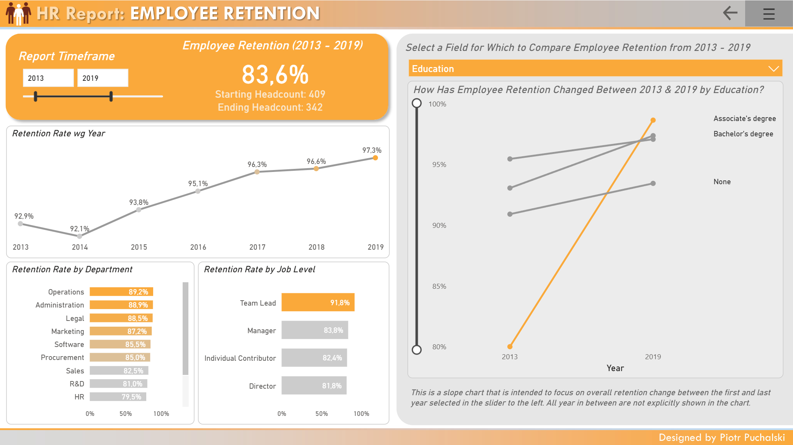
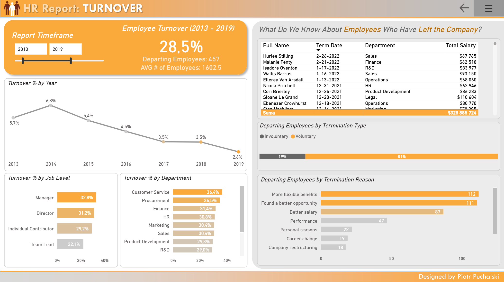
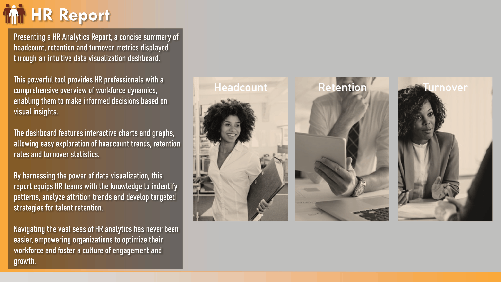
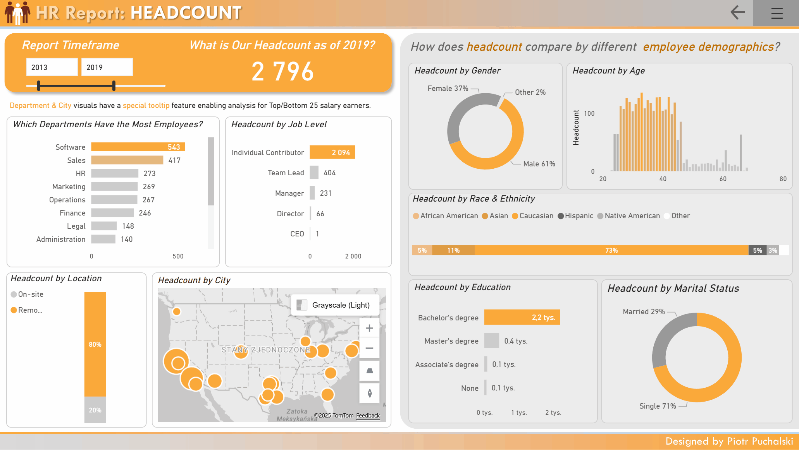
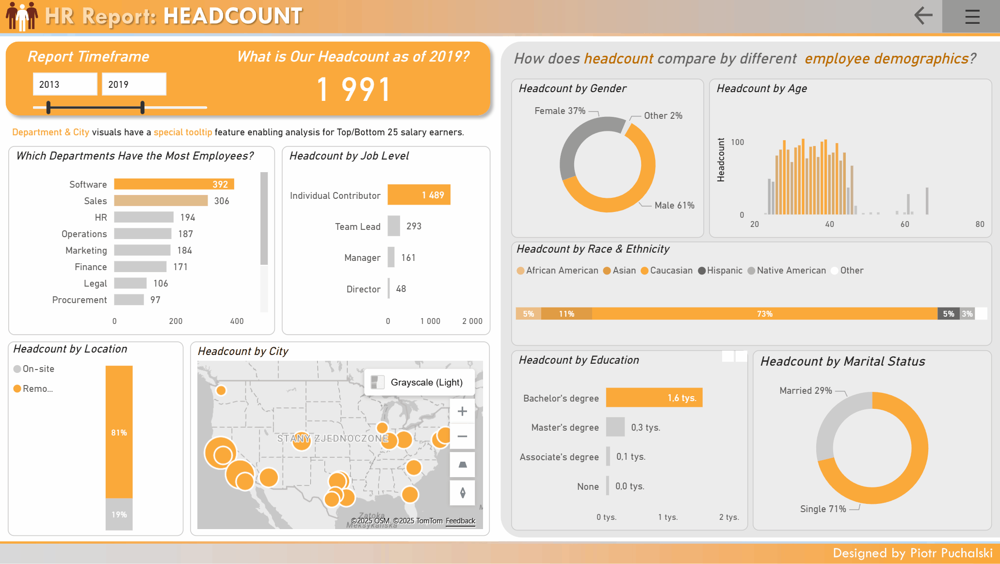

# HR Analytics - Problem Description

## This report aims to answer essential HR and business questions, including:
- **Cover Page** – Introduces the user to the app's features and navigation.
- **Headcount View** – Workforce Structure
  - How has the number of employees changed over time?
  - Which departments have the highest number of employees?
  - How is the workforce distributed by location, age, gender, race/ethnicity, job level, and education?
  
  👉 This enables better workforce planning, identification of potential disparities, and insights into talent distribution across the organization.

- **Retention View** – Keeping Talent
  - What is the employee retention trend from year to year?
  - Which departments and job levels have the highest retention rates?
  - How does retention differ across demographic groups (e.g., education level)?

  👉 These insights help HR teams understand which employee groups are most stable and where retention risks may be emerging.

- **Turnover View** – Understanding Attrition
  - How many employees left the company, and what is the overall turnover rate?
  - Which departments and job levels experience the highest turnover?
  - What are the reasons for employee departures (voluntary vs. involuntary)?
  - What is the financial impact of turnover (e.g., total salaries of departing employees)?

  👉 This analysis supports retention strategies, helps identify root causes of attrition, and assists in forecasting costs associated with employee turnover.

## 🖼️ Screenshots and Gifs

### Cover Page

### Headcount Page

### Retention Page

### Turnover Page

### Navigation Demo

### Page Tooltip Demo

### Filter Panel Demo

