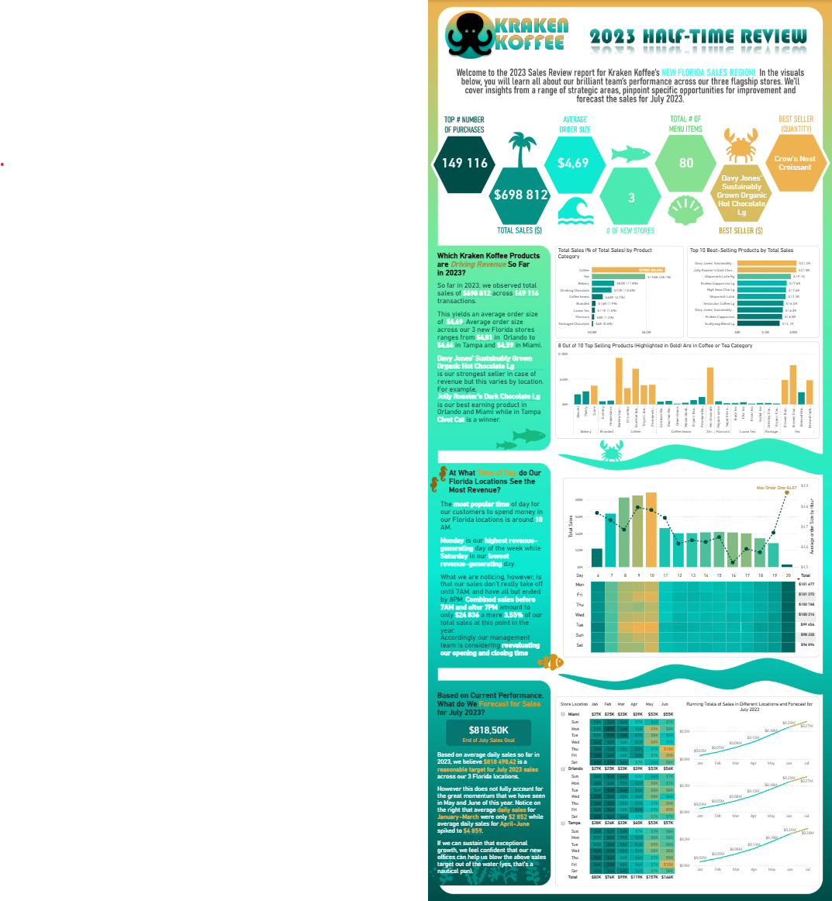
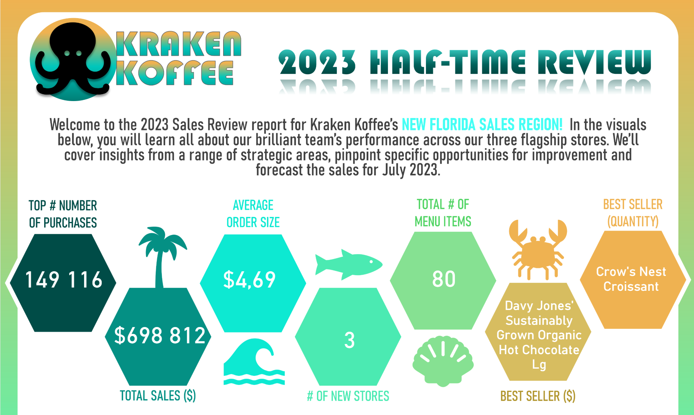
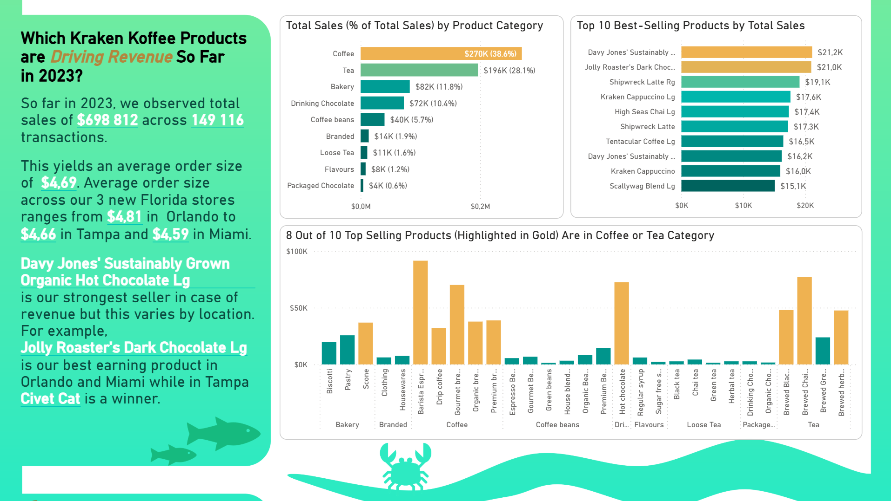
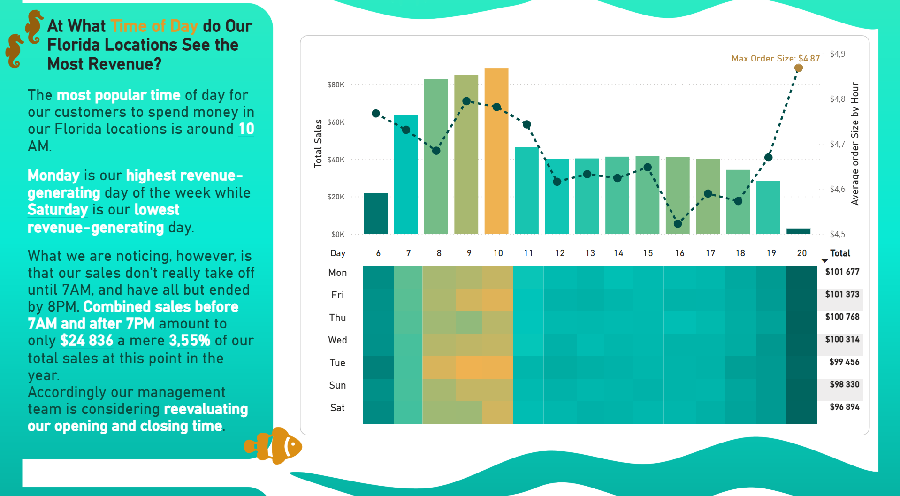
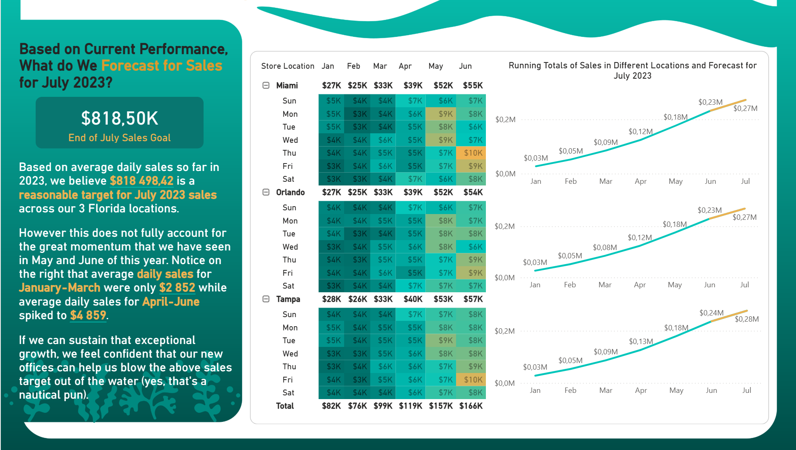

# Kraken Koffee - Problem Description

This infographic presents the performance of three newly opened stores of the Kraken Koffee company.

## ❓Key questions addressed:
- What are the overall sales figures, average order sizes, and best-selling products?
- Which days of the week and times generate the highest revenue, and is there a need to reevaluate store opening hours based on this data?
- What is the sales forecast for upcoming periods?

## 🖼️ Screenshots and Gifs

### Overall Look

### Intro and KPIs

### Products Comparison

### Weekday and Time Comparison

### Forecast

