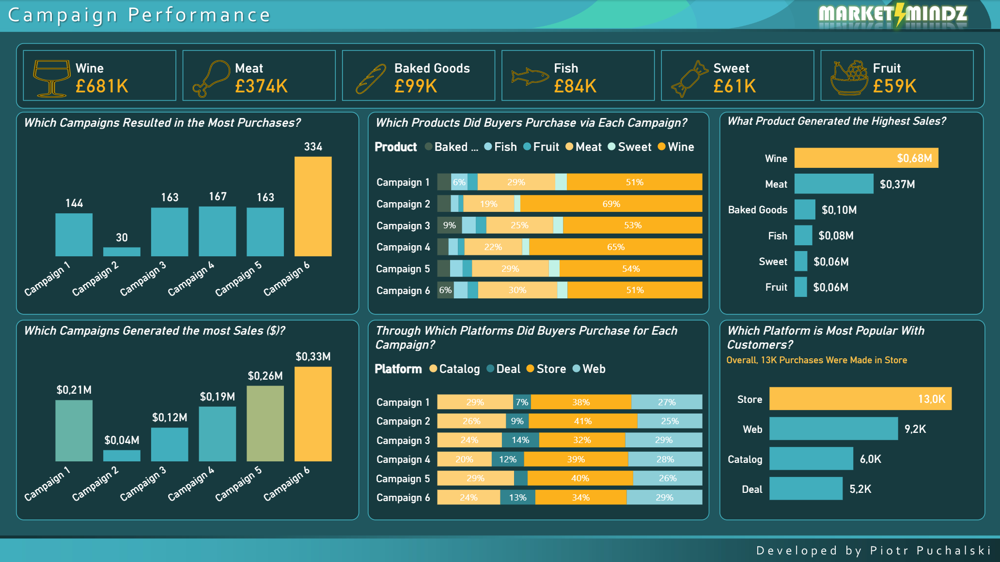
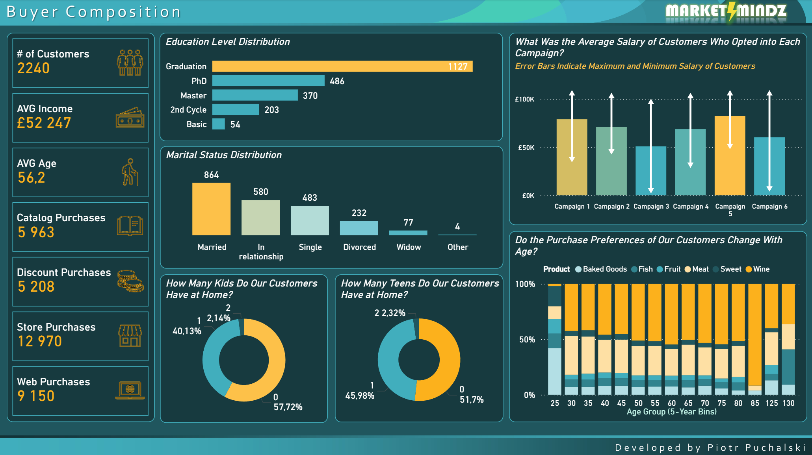
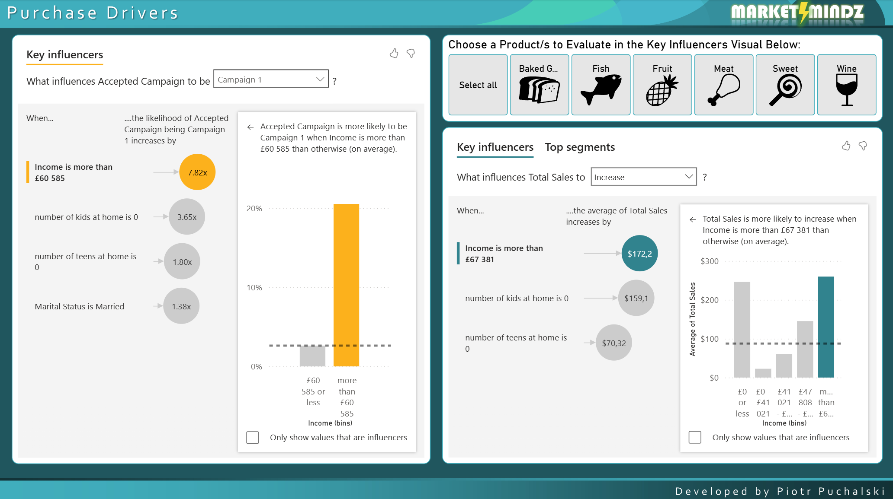

# MarketMindz - Problem Description

Market research firm MarketMindz is collaborating with a retail vendor specializing in food and beverage products.

## ❓Key questions addressed:
- How are our six recent marketing campaigns performing?
- How are our products performing?
- Who are our customers?
- What factors are driving campaign performance and buyer decision-making?

## 🖼️ Screenshots

### Campaign Performance

### Customer Composition

### Purchase Drivers

